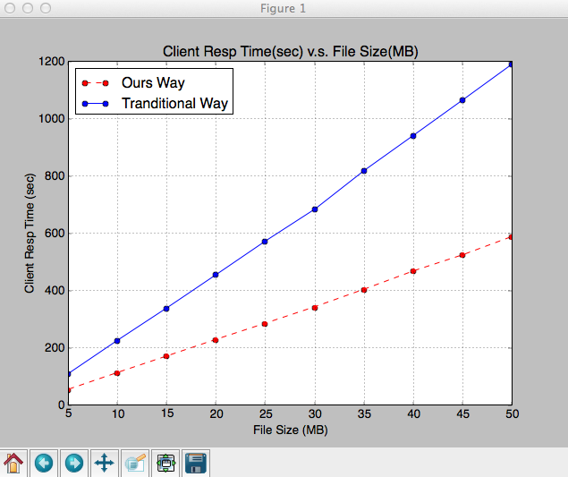

MatPlotLib for Ruby
====

This tool is a simple warpper that makes it easy to use MatPlotLib.

It's based on RubyPython, so you must make sure you have Python environment and installed the matplotlib.


## Demo Code 

You can find it on [here](https://github.com/HondaDai/matplotlib-for-ruby/blob/master/demo.rb) !

```ruby

$LOAD_PATH << "./lib"
require 'matplotlib.rb'

ours_way_data = [53.9, 112.74, 170.46, 228.49, 284.84, 342.16, 403.48, 467.28, 523.62, 587.62]
trad_way_data = [109.47, 226.04, 339.01, 455.16, 572.44, 683.66, 818.47, 941.26, 1064.93, 1189.95]

sizes = [5242880, 10485760, 15728640, 20971520, 26214400, 31457280, 36700160, 41943040, 47185920, 52428800]

fig, ax = Plot.subplots 

ax.plot! sizes, ours_way_data, 'ro--', label:  "Ours Way"
ax.plot! sizes, trad_way_data, 'o-', label: "Tranditional Way"

ax.set_xticks sizes
ax.set_xlim sizes.minmax
ax.set_xticklabels sizes.map {|x| x/1024/1024 }
ax.grid
ax.legend! loc: "upper left"

Plot.title "Client Resp Time(sec) v.s. File Size(MB)"
Plot.xlabel "File Size (MB)"
Plot.ylabel "Client Resp Time (sec)"

# Plot.savefig "client_resp.png"
Plot.show


```

## Result


